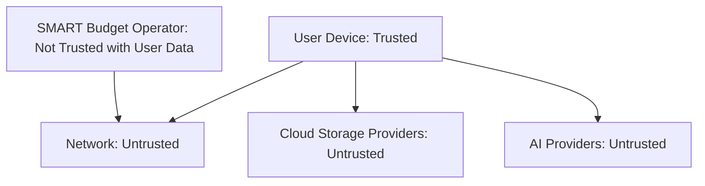
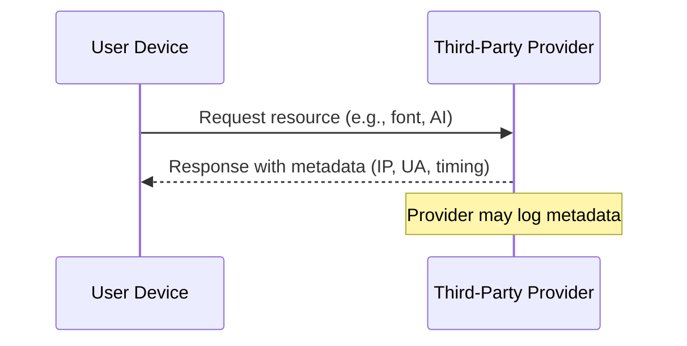
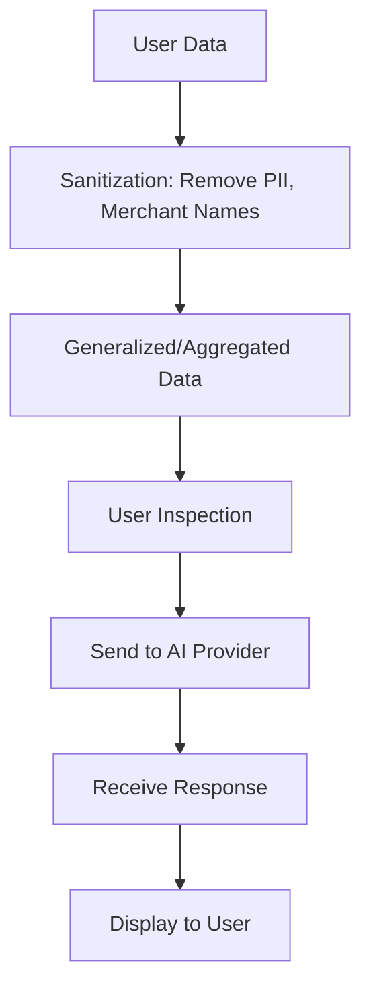
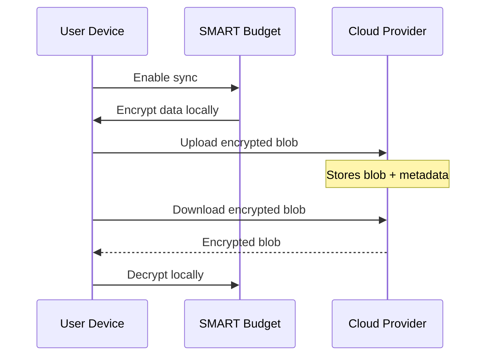

# Security & Privacy

**Last updated:** December 25, 2025  
**Version:** 1.0

This page explains how SMART Budget protects user data, what guarantees are provided, and—critically—what is not protected.

## 1. Scope and Intent

SMART Budget is designed as a local-first budgeting application. By default, financial data is stored and processed only on the user's device.

This document describes:

- What data is protected
- How cryptographic protections are applied
- When data may leave the device
- The limits of these protections

This document does not describe product features or business logic.

## 2. Non-Goals and Out-of-Scope Threats

SMART Budget does not claim to protect against:

- A compromised operating system or browser
- Malicious browser extensions
- Physical access to an unlocked device
- Rooted or jailbroken environments
- Malware running with user privileges

If the execution environment is compromised, confidentiality cannot be guaranteed.

## 3. High-Level System Model

SMART Budget runs as a Progressive Web App (PWA).

The application functions fully offline by default.

Optional features (AI, cloud sync) require explicit user opt-in.

### Trust Boundaries

## 4. Data Protection Model

### 4.1 Local Storage

Financial records (expenses, categories) are stored locally.

Data at rest is encrypted before being written to browser storage.

Browser storage (IndexedDB) is used for persistence.

IndexedDB provides durability, not protection against a compromised browser.

### 4.2 Cryptography

SMART Budget uses the following cryptographic primitives:

- Encryption: AES-256-GCM
- Key derivation: PBKDF2
- Key material: derived locally on the user's device

Encryption and decryption occur only on the client.

Encryption keys:

- Are generated locally
- Are never transmitted to SMART Budget servers
- Are never accessible to the SMART Budget operator

Loss of the recovery phrase results in permanent loss of access to encrypted data.

### 4.3 Authentication vs Encryption

Authentication (login, OTP, session management) is used to authorize access to locally stored encryption keys.

Authentication does not generate encryption keys and does not replace the recovery phrase.

## 5. Data Classification

| Data Type       | Encrypted | Stored Locally | Leaves Device |
|-----------------|-----------|----------------|---------------|
| Expenses       | Yes      | Yes           | No (default) |
| Categories     | Yes      | Yes           | No (default) |
| Recovery phrase| No       | User-controlled| No           |
| AI prompts     | Yes (pre-send) | No       | Yes (opt-in only) |
| Error codes    | No       | Yes           | Possibly     |
| Email address  | No       | Server        | Yes (OTP only) |

SMART Budget does not store plaintext financial data on its servers.

## 6. Network and Third-Party Interactions

### 6.1 Offline Behavior

The application operates offline by default.

### 6.2 Third-Party Resources

SMART Budget loads limited third-party resources (e.g., fonts, email delivery, AI providers).

These providers may receive standard web metadata such as:

- IP address
- User agent
- Request timing

SMART Budget does not control third-party retention or logging policies.

No analytics or behavioral tracking services are used.

## 7. AI Features (Optional)

AI features are:

- Disabled by default
- Enabled only with user-provided API keys

### 7.1 Data Handling

Before any AI request:

- Personally identifiable information is removed
- Merchant names, notes, and identifiers are excluded
- Only generalized or aggregated data is used

Users can inspect the exact payload before it is sent.

SMART Budget does not store AI prompts or responses.

## 8. Cloud Sync (Optional)

By default, no data is synced or stored remotely.

If cloud sync is enabled:

- Data is encrypted before upload
- Only encrypted blobs are stored
- Storage providers cannot decrypt user data
- Metadata such as object size and upload timing may be visible to the provider

SMART Budget cannot access or decrypt synced data.

## 9. Email and Identity

Email addresses are used only for:

- Account verification
- One-time password (OTP) delivery

No financial data is transmitted via email.

## 10. Negative Guarantees

SMART Budget explicitly cannot:

- Read user financial data
- Recover lost encryption keys or recovery phrases
- Decrypt synced data
- Export user data without user action
- Access AI provider API keys

These limitations are by design.

## 11. Auditability and Transparency

To support independent review:

- Cryptographic design and threat model are documented publicly
- Selected security-critical components may be published for inspection

Product logic, UX, and infrastructure are not publicly disclosed.

This balances verifiability with product integrity.

## 12. Changes and Updates

Security-relevant changes are:

- Versioned
- Documented
- Communicated in release notes

Backward compatibility is preserved where possible.

## 13. Responsible Disclosure

Security issues can be reported to: [SMARTBudget@sirisarah.com](mailto:SMARTBudget@sirisarah.com)

Reports are reviewed promptly and handled responsibly.
