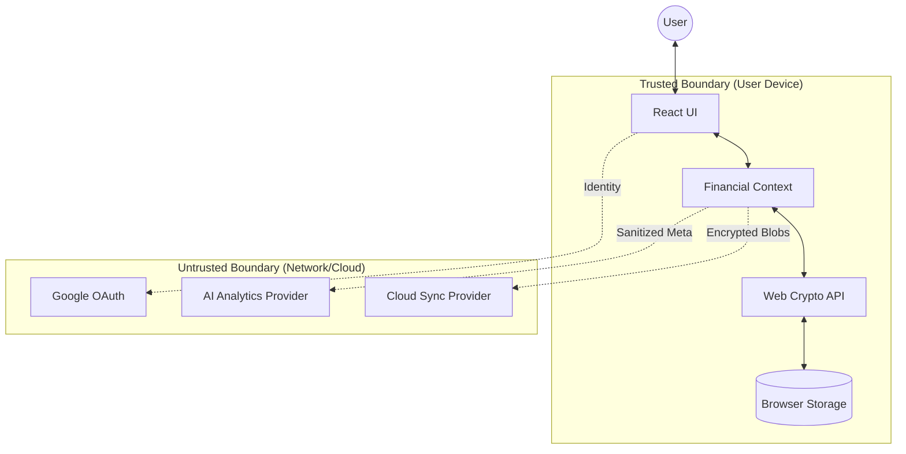
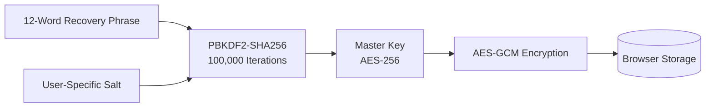
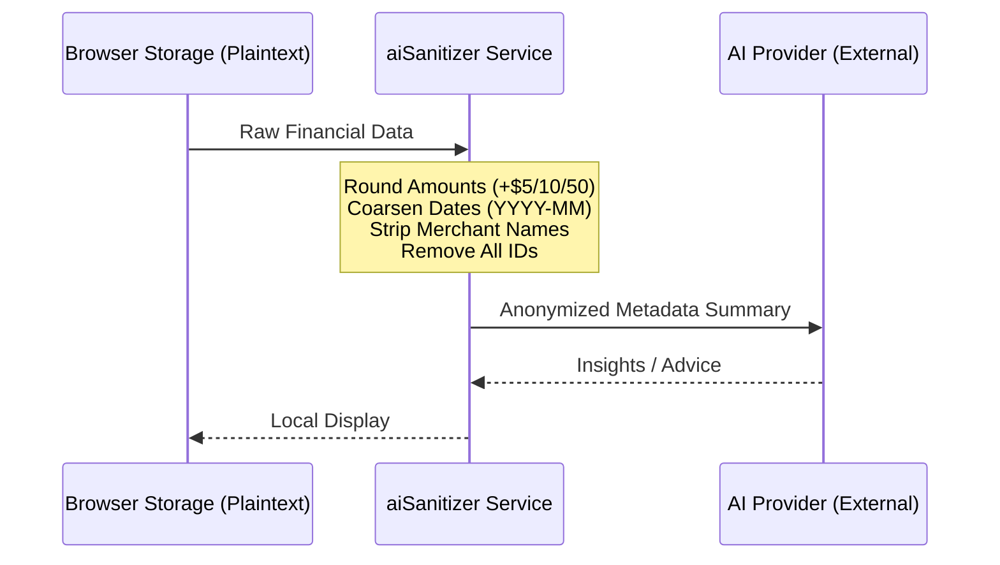

# SMART Budget: Security & Privacy Whitepaper

> [!NOTE]
> **Status**: Public  
> **Version**: 0.1.0-beta  
> **Last Updated**: December 25, 2025  
> **Scope**: Verifiable security guarantees for the SMART Budget application.

---

## 0. Document Control

| Version | Date | Summary of Changes |
| :--- | :--- | :--- |
| 0.1.0-beta | Dec. 25, 2025 | Initial release of verifiable security architecture. |

**Security Contact**: [SMARTBudget@sirisarah.com](mailto:SMARTBudget@sirisarah.com)

---

## 1. Purpose and Scope

### 1.1 Purpose
This document provides technical evidence for the **Zero-Knowledge Architecture** and **Local-First** design of SMART Budget. It defines the cryptographic standards, trust boundaries, and data handling procedures that ensure user financial data remains private and sovereign.

### 1.2 Non-Goals
SMART Budget focuses on securing data at rest and in transit. It does **not** protect against:
- Compromised host operating systems or browsers (e.g., malware, keyloggers).
- Malicious browser extensions with "broad access" permissions.
- Physical access to unencrypted/unlocked devices.
- Rooted or jailbroken environments where system-level sandboxing is disabled.

---

## 2. System Overview

### 2.1 Product Model: Local-First PWA
SMART Budget is a Progressive Web Application (PWA) that operates **fully offline by default**. All primary data storage and processing occur on the user's local device.

### 2.2 Trust Boundaries
- **User Device (Trusted)**: The only environment where decryption keys and plaintext financial data exist.
- **Network (Untrusted)**: All data leaving the device is either encrypted (AES-GCM) or sanitized (PII-free).
- **Cloud/AI Providers (Untrusted)**: These entities never receive the keys required to decrypt user records.

---

## 3. Threat Model

### 3.1 Protected Assets
1. **Financial Records**: Full transaction History, accounts, and budgets.
2. **Cryptographic Identity**: The 12-word recovery phrase and derived master keys.
3. **User Metadata**: Timestamps, transaction counts, and category labels.

### 3.2 Adversary Model
| Adversary | Capability | SMART Budget Mitigation |
| :--- | :--- | :--- |
| **Network Observer** | Intercepts HTTPS traffic | Data is encrypted *before* transmission. |
| **Cloud Provider** | Full access to stored files | Lacks keys to decrypt binary blobs. |
| **AI Provider** | Analyzes provided context | Receives only rounded, anonymized metadata. |
| **Developer** | Controls app source code | Architecture prevents server-side access to keys. |

---

## 4. Cryptographic Design

### 4.1 Technical Primitives
SMART Budget relies exclusively on standardized, high-entropy primitives via the **Web Crypto API**:
- **Encryption**: AES-256-GCM (Authenticated Encryption).
- **Key Derivation**: PBKDF2 with **100,000 iterations** using SHA-256.
- **Entropy**: 12-word BIP39-compatible recovery phrases.

### 4.2 Key Hierarchy
The master key is never stored in plaintext. It is derived on-the-fly and held in a memory closure during the active session.

> [!IMPORTANT]
> **No Key Escrow**: SMART Budget developers do not hold copies of encryption keys. Loss of the recovery phrase results in **permanent data loss**.

---

## 5. Data Storage & Classification

### 5.1 Encryption-at-Rest
All sensitive entities (Transactions, Budgets, Goals, Debts) are serialized and encrypted using a unique IV per record before being committed to **Browser Storage** (IndexedDB/LocalStorage). 

| Data Type | Encrypted | Leaves Device | Anonymized |
| :--- | :---: | :---: | :---: |
| Financial Records | ✅ | Optional (Sync) | ❌ |
| Recovery Phrase | ❌ (Local Only) | ❌ | ❌ |
| AI Prompt Context | ❌ | ✅ | ✅ |
| UI Preferences | ❌ | ❌ | ❌ |

---

## 6. AI Features & Sanitization

### 6.1 Privacy Pipeline
When a user opts-in to AI features, data is passed through a deterministic sanitization layer before transmission.

> [!TIP]
> **Payload Inspection**: All sanitization logic is visible in `src/services/aiSanitizer.ts` for public audit.

---

## 7. Sync Architecture

### 7.1 Zero-Knowledge Cloud Sync
Sync providers (e.g., Google Drive) are treated as untrusted object stores.

1. **Local Encryption**: Data is encrypted with the user's master key.
2. **Blob Generation**: A versioned, checksummed binary blob is created.
3. **Secure Upload**: The blob is uploaded via OAuth-authorized channel.
4. **Decryption**: Only possible on authorized devices with the same recovery phrase.

---

## 8. Verifiability & Disclosure

### 8.1 Public Verification
Interested parties can verify the following components in the disclosure repository:
- `crypto/encryption.ts`: AES-GCM and PBKDF2 implementation.
- `ai-sanitization/sanitize.ts`: Anonymization logic.
- `key-management/secureStorage.ts`: Security of data at rest.
- `sync-encryption/sync_format.ts`: Security of data in transit.

### 8.2 Security Disclosure
We welcome responsible reports of vulnerabilities. Please coordinate disclosures via the security contact email provided in Section 0. We commit to acknowledging reports within 48 hours.

---

### 10. Negative Guarantees
- **We cannot** read your financial data at rest or in transit.
- **We cannot** recover your account if you lose your 12-word phrase.
- **We cannot** see your bank merchant names or specific notes when using AI.
- **We cannot** bypass 2FA if you have enabled it.